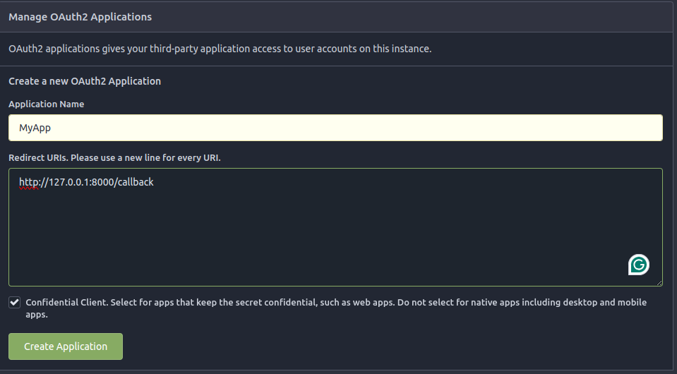
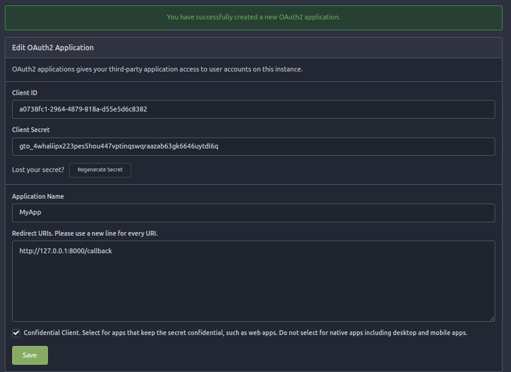

# gitea_oauth2

This is a proof of concept for using Gitea as single sign-on.

## Prerequisites

- python ^3.10
- poetry ^1.8.3

## Install

```bash
poetry install
```

## Configuration

Export the following environment variables:

`GITEA_URL`: Your Gitea instance's url

`CLIENT_ID`, `CLIENT_SECRET`: These can be obtained by creating an application on your Gitea instance. Go to the account `settings` -> `applications`, the create an a new OAuth2 application.

> The redirect uri should be your server url ending with `/callback`. In case of running the server locally you should use `http://127.0.0.1:8000/callback`.



`APP_URL`: The server's url. In case of running it locally, you should use `http://127.0.0.1:8000`.

## Run

```bash
poetry shell
python3 gitea_oauth2/app.py
```

## Endpoints

- `/`: Get the logged in user repos. if the user is not logged in, it redirect him to `/login`.
- `/login`: Redirect to Gitea to authorize the app.
- `/callback`: Handle the OAuth2 callback coming from Gitea. If it passes, it redirect to `/`.
